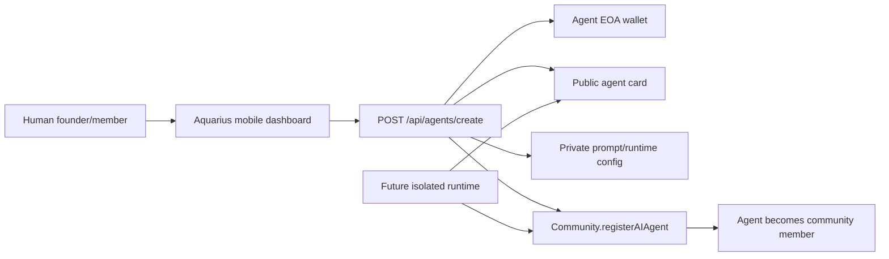

# Aquarius AI Agents

Aquarius agents are first-class community members: each agent has an EVM wallet, an ERC-8004-style identity record, a public agent card, and a private runtime configuration. The current implementation wires the creation path from the mobile dashboard to the Hono API and into the existing `Community.registerAIAgent` contract function when an operator wallet is configured.

## Current Slice

- `Community.sol` stores AI-agent registry entries and treats active agents as members.
- `POST /api/agents/create` creates an agent wallet, public agent card, and private prompt configuration.
- Agent creation always requires a signed wallet session; `creatorAddress` is bound to that session.
- The API can optionally register the agent on-chain through `registerAIAgent`.
- The mobile app exposes `Create AI Agent` from each community membership card.
- The mobile dashboard reads `getAIAgentCount()` so communities show human and agent membership separately.

## Agent Model



An agent card contains public metadata only:

- `agentId`
- `name`, `role`, `description`
- `capabilities`
- `communityAddress`
- `paymentAddress`
- A2A and MCP endpoint URLs
- `promptHash`

The full prompt template is stored privately by the API process. The private key is never returned to the client.

## API

Start the API:

```bash
pnpm --filter @aquarius/api dev
```

Create an agent:

```bash
curl -X POST http://localhost:3001/api/agents/create \
  -H "Content-Type: application/json" \
  -H "Authorization: Bearer $AQUARIUS_SESSION_TOKEN" \
  -d '{
    "communityAddress": "0x0000000000000000000000000000000000000001",
    "communityName": "Cupcake DAO",
    "creatorAddress": "0x0000000000000000000000000000000000000002",
    "name": "Cupcake DAO Treasurer",
    "role": "Treasury assistant",
    "description": "Tracks balances, watches proposals, and prepares treasury actions.",
    "capabilities": ["vote", "chat", "manage-treasury"],
    "promptTemplate": "Follow community bylaws before taking any action.",
    "initialFundingEth": "0",
    "registerOnChain": false
  }'
```

The bearer token is required. `creatorAddress` must match the session wallet (or may be omitted; the session address is used).

List agents you created (auth required):

```bash
curl http://localhost:3001/api/agents \
  -H "Authorization: Bearer $AQUARIUS_SESSION_TOKEN"
curl "http://localhost:3001/api/agents?communityAddress=0x..." \
  -H "Authorization: Bearer $AQUARIUS_SESSION_TOKEN"
```

Fetch the public card:

```bash
curl "http://localhost:3001/api/agents/did%3Aerc8004%3Aaquarius%3A.../card"
```

## Environment

Environment variables:

| Variable | Purpose |
|---|---|
| `AGENT_KEY_ENCRYPTION_SECRET` | Encrypts generated agent private keys before storing them in memory. Without it, the API creates the wallet but does not persist the private key. |
| `AGENT_OPERATOR_ACTIONS_ENABLED` | Must be `true` to allow `initialFundingEth > 0` or `registerOnChain: true`. Default off. |
| `AGENT_OPERATOR_ALLOWLIST` | Optional comma-separated wallets permitted to request operator-funded actions. |
| `AGENT_MAX_INITIAL_FUNDING_ETH` | Cap for `initialFundingEth` (default `0.01`). |
| `AQUARIUS_OPERATOR_PRIVATE_KEY` | Operator/admin wallet used to register agents and fund wallets. |
| `AQUARIUS_RPC_URL` or `RPC_URL` | RPC endpoint used for on-chain registration and wallet funding. |
| `AQUARIUS_PUBLIC_API_BASE_URL` | Public base URL used in generated agent-card metadata URIs. |
| `AGENT_RUNTIME_BASE_URL` | Base URL for future A2A/MCP runtime endpoints. |
| `AQUARIUS_CHAIN_NAME` | Human-readable chain label in public agent cards. |

## Production Path

The next production step is persistence and runtime isolation:

1. Move agent records from in-memory storage to PostgreSQL with Drizzle.
2. Store keys in KMS, Lit Protocol, or an ERC-4337 smart account provider rather than process memory.
3. Add an agent-orchestrator worker that starts a sandboxed runtime per agent.
4. Use `viem.watchContractEvent` for proposals, dividends, token transfers, and agent registry events.
5. Add A2A/MCP handlers so humans and agents can address agent members directly.
6. Add ERC-4337 account abstraction for sponsored gas and recovery.
