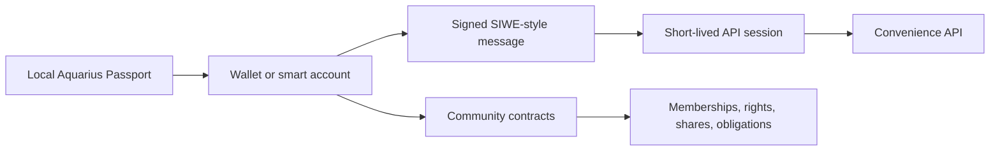

# Aquarius Identity and Login

Aquarius does not use usernames and passwords as the root of identity. A user proves control of a wallet, and the blockchain defines what that wallet can see or do in each community.

The short version:

```text
wallet signature proves identity
contracts define authority
local Passport groups the user's own wallets
API sessions are temporary convenience tokens
```

## Model



The important split:

- **Identity:** wallet, smart account, or linked wallet set.
- **Authority:** contracts, token balances, shares, proposal state, and obligations.
- **Experience:** local app state, API cache, indexers, notifications, and search.

The app and API can make the product fast and pleasant, but they should not become the source of truth for community authority.

## Code Touchpoints

| Area | File |
|---|---|
| API auth routes | `packages/api/src/routes/auth.ts` |
| Mobile auth hook | `apps/mobile/src/hooks/useWalletAuth.ts` |
| Local Passport store | `apps/mobile/src/hooks/useWalletStore.ts` |
| Signing key storage | `apps/mobile/src/wallet/keyStorage.ts` |
| WalletClient / signer | `apps/mobile/src/wallet/signer.ts` |
| Wallet connect UI | `apps/mobile/src/components/WalletConnect.tsx` |
| Agent auth enforcement | `packages/api/src/routes/agents.ts` |

## Implemented Flow

1. The user creates or imports a personal local wallet (SecureStore on native). Optionally, with `EXPO_PUBLIC_AQUARIUS_DEV_SIGNER=1`, they may choose Anvil account #0 for local gas — never as a silent default.
2. The app requests `POST /api/auth/challenge`.
3. The API returns a Sign-In with Ethereum style message with a one-time nonce and a five-minute expiration.
4. The same `getWalletClient()` wallet that will sign transactions signs the message locally.
5. The app sends the signature to `POST /api/auth/verify`.
6. The API verifies the signature with `viem.verifyMessage`.
7. The API deletes the nonce so the challenge cannot be reused.
8. The API returns a 12-hour session token.
9. The app stores that session and linked wallet in a local Aquarius Passport.

The private key never goes to the API and is never written into the Passport AsyncStorage blob.

## Challenge Details

The challenge route accepts:

| Field | Purpose |
|---|---|
| `address` | Wallet address that will sign the message |
| `chainId` | Chain context for the signature |
| `domain` | Human-readable app domain, currently `Aquarius` |
| `uri` | App URI, currently `https://aquariusapp.eth` |
| `statement` | Sign-in statement shown inside the message |
| `resources` | Resource hints, currently defaults to `aquarius://identity` |

The API stores challenges in memory by nonce. Verification fails if the challenge is missing, expired, reused, mismatched, or signed by the wrong address.

## Session Token

The current session token is an HMAC-signed payload:

- Payload contains `sessionId`, wallet `address`, `chainId`, `issuedAt`, and `expiresAt`.
- Signature uses `AQUARIUS_AUTH_SECRET` when set.
- If `AQUARIUS_AUTH_SECRET` is not set in non-production, the API uses a process-local random secret, so sessions are invalidated when the API restarts.
- Production deployments must set `AQUARIUS_AUTH_SECRET`; the process exits on boot without it.
- The server also keeps a session map in memory so logout can revoke a token before expiration.

This token does not grant blockchain authority. It only lets the API know, for a short window, that the caller recently proved control of a wallet.

## Local Aquarius Passport

The mobile app persists Passport metadata in AsyncStorage under `aquarius-wallet-passport`.

Persisted today:

- Current API session.
- Linked wallet list.
- Wallet address.
- Chain ID.
- Wallet label.
- `addedAt` and `lastSignedInAt` timestamps.

Signing keys are stored separately:

- Native: `expo-secure-store` (Keychain / Keystore).
- Web preview: AsyncStorage fallback under `aquarius-signing-key-web-insecure` — **not safe for real funds**.

Threat model summary: device compromise or rooted/jailbroken hosts can still expose keys; the goal is to avoid plaintext key material in the Passport blob, logs, or the API. Production should move toward external connectors and ERC-4337 smart accounts so the app never holds a long-lived raw EOA key.

The Passport is intentionally local-first. It lets one human group multiple wallets on one device without publishing a public wallet-link graph. In production, users should be able to opt into public wallet-link attestations only when that helps them.

## Protected API Actions

Agent creation always requires a wallet session. Omitting `creatorAddress` no longer bypasses auth.

```text
Authorization: Bearer <session token>
```

The API binds `creatorAddress` to the session wallet. If the body includes a different `creatorAddress`, the request is rejected. Listing agents (`GET /api/agents`) is also session-scoped to the caller's creations; public agent cards remain available at `GET /api/agents/:id/card`.

### Auth abuse controls

- `POST /api/auth/challenge` and `POST /api/auth/verify` are rate-limited in-process by IP and address (HTTP 429 + `Retry-After`).
- Expired challenges are purged; the challenge map is size-bounded.
- In production (`NODE_ENV=production` or `AQUARIUS_ENV=production`), the API refuses to start (and will not issue sessions) without `AQUARIUS_AUTH_SECRET`.

| Variable | Purpose |
|---|---|
| `AQUARIUS_AUTH_SECRET` | Required in production; HMAC secret for session tokens |
| `AQUARIUS_CORS_ORIGINS` | Comma-separated browser origin allowlist |

## API

Create a challenge:

```bash
curl -X POST http://localhost:3001/api/auth/challenge \
  -H "Content-Type: application/json" \
  -d '{
    "address": "0x0000000000000000000000000000000000000001",
    "chainId": 31337,
    "domain": "Aquarius",
    "uri": "https://aquariusapp.eth"
  }'
```

Verify a signature:

```bash
curl -X POST http://localhost:3001/api/auth/verify \
  -H "Content-Type: application/json" \
  -d '{
    "message": "...challenge message...",
    "signature": "0x..."
  }'
```

Check a session:

```bash
curl http://localhost:3001/api/auth/session \
  -H "Authorization: Bearer $AQUARIUS_SESSION_TOKEN"
```

## Multi-Community Context

A single wallet may hold:

- Memberships across many communities.
- Community tokens.
- Institution shares.
- Proposal voting rights.
- Credit receiving agreements.
- Credit remitting obligations.
- Agent-management rights.

Aquarius reads this from contracts and event history. The local Passport only helps the user group multiple wallets together on their device.

## Multiple Wallets

One human may reasonably control several addresses:

- Main personal wallet.
- Hardware wallet.
- Community-specific wallet.
- Treasury multisig.
- Agent-admin wallet.
- Future ERC-4337 smart account.

The first implementation stores linked wallets locally. A future public linking mode should use signed wallet-link attestations so users can choose when to reveal that multiple addresses belong together.

## Production Path

1. Add WalletConnect v2 / Coinbase Wallet so users sign with external self-custody wallets.
2. Support hardware wallets where the private key never enters app memory.
3. Support ERC-1271 verification for smart contract wallets.
4. Add ERC-4337 smart accounts for passkeys, gas sponsorship, and recovery.
5. Store only public profile metadata off-chain; keep rights and obligations contract-defined.
6. Make indexers replaceable by reconstructing state from contract events.
7. Add optional encrypted backup for local Passport metadata, never raw private keys.
