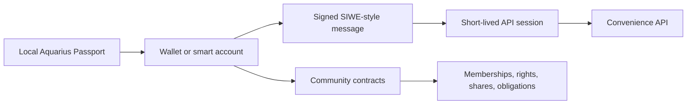

# Aquarius Identity and Login

Aquarius does not use usernames and passwords as the root of identity. A user proves control of a wallet, and the blockchain defines what that wallet can see or do in each community.

## Model



The important split:

- **Identity:** wallet, smart account, or linked wallet set.
- **Authority:** contracts, token balances, shares, proposal state, and obligations.
- **Experience:** local app state, API cache, indexers, notifications, and search.

The app and API can make the product fast and pleasant, but they should not become the source of truth for community authority.

## Implemented Flow

1. The user creates or imports a local dev wallet.
2. The app requests `POST /api/auth/challenge`.
3. The API returns a Sign-In with Ethereum style message with a nonce and expiration.
4. The wallet signs the message locally.
5. The app sends the signature to `POST /api/auth/verify`.
6. The API verifies the signature and returns a short-lived session token.
7. The app stores that session and linked wallet in a local “Aquarius Passport.”

The private key never goes to the API.

## API

Create a challenge:

```bash
curl -X POST http://localhost:3001/api/auth/challenge \
  -H "Content-Type: application/json" \
  -d '{
    "address": "0x0000000000000000000000000000000000000001",
    "chainId": 31337,
    "domain": "Aquarius",
    "uri": "https://aquariusapp.eth"
  }'
```

Verify a signature:

```bash
curl -X POST http://localhost:3001/api/auth/verify \
  -H "Content-Type: application/json" \
  -d '{
    "message": "...challenge message...",
    "signature": "0x..."
  }'
```

Check a session:

```bash
curl http://localhost:3001/api/auth/session \
  -H "Authorization: Bearer $AQUARIUS_SESSION_TOKEN"
```

## Multi-Community Context

A single wallet may hold:

- Memberships across many communities.
- Community tokens.
- Institution shares.
- Proposal voting rights.
- Credit receiving agreements.
- Credit remitting obligations.
- Agent-management rights.

Aquarius reads this from contracts and event history. The local Passport only helps the user group multiple wallets together on their device.

## Multiple Wallets

One human may reasonably control several addresses:

- Main personal wallet.
- Hardware wallet.
- Community-specific wallet.
- Treasury multisig.
- Agent-admin wallet.
- Future ERC-4337 smart account.

The first implementation stores linked wallets locally. A future public linking mode should use signed wallet-link attestations so users can choose when to reveal that multiple addresses belong together.

## Production Path

1. Add WalletConnect/Coinbase Wallet so users sign with external self-custody wallets.
2. Support ERC-1271 verification for smart contract wallets.
3. Add ERC-4337 smart accounts for passkeys, gas sponsorship, and recovery.
4. Store only public profile metadata off-chain; keep rights and obligations contract-defined.
5. Make indexers replaceable by reconstructing state from contract events.
6. Add optional encrypted backup for local Passport metadata, never raw private keys.
